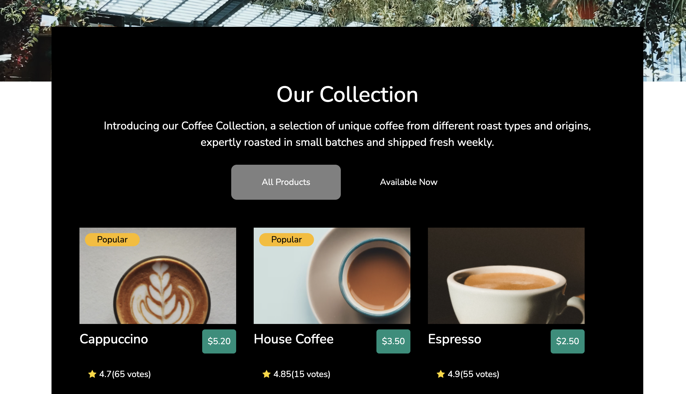

# Simple-Coffee-Listing
This project is just an introduction to a coffee collection, a selection of unique coffees from different roast types and origins. 
Here is the [Link](https://elijah-cod.github.io/Simple-Coffee-Listing/) to access the project.



## Coffee Listings
We achieved this by using the API provided to dynamically present the different coffee brands we have in stock
```javascript
async function captureData () {
    try {
        const response = await fetch(url)
        const data = await response.json()
        render(data)
    } catch (error) {
        console.error('Error:', error)
    }
}
```
## Displaying the data to the DOM
We achieved this by looping through each object in the provided data.
```javascript
 data.forEach(element => {
        creatingCards(element)
    })
```
And then, we dynamically created cards for the respective data by:
* Checking if the coffee is popular
```javascript
if (element.popular){
        const popular = creatingElements('div', 'popular')
        popular.innerText = "Popular"
        card.append(popular)
    } 
```
* Checking if the coffee was rated
```javascript
  if (element.rating == null) {
        const ratings =  creatingElements('div', 'ratings')
        //Adding the no rating font awesome icons to the DOM
        const i = creatingIcons("fa-star-o")
        ratings.append(i)
        const p = creatingElements('p', 'card-text')
        p.innerText = "No ratings"
        ratings.append(p)
        cardBody.append(ratings)
    }
```
* Checking if the coffee was available
```javascript
  if (!element.available){
            const p1 = creatingElements('p', 'sold')
            p1.innerText = "Sold out"
            bottom.append(p1)
        }
```
## API Reference
* Get the coffee listing
```http
https://raw.githubusercontent.com/devchallenges-io/web-project-ideas/main/front-end-projects/data/simple-coffee-listing-data.json
```